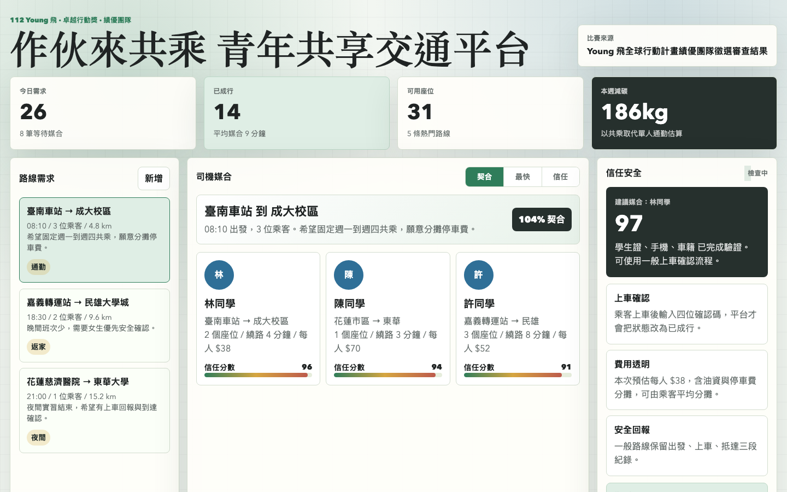
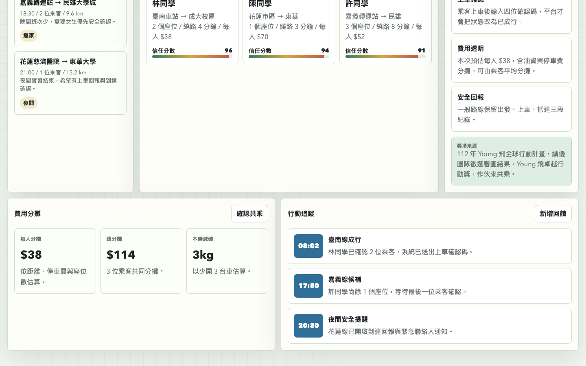

# YoungFly Carpool Platform

## 快速看懂

- 線上 Demo：https://atlasforcn.github.io/startup-youngfly-carpool/
- 這個原型在做什麼：把作伙來共乘做成青年共享交通與共乘媒合平台。
- 特色定位：特色是把路線、座位、信任資訊與費用分攤放入共乘流程。
- 操作流程：建立或搜尋共乘路線 → 查看乘客/駕駛資訊、座位與費用 → 完成媒合後追蹤出發、抵達與評價

展開完整功能流程截圖

這個 repo 是依據 `作伙來共乘` 在 Young 飛全球行動計畫中的績優團隊概念做出的前端原型。原型把「共乘媒合」理解成一個以路線、時段、信任評價與費用分攤為核心的青年共享交通平台。

## 比賽來源

- 比賽/計畫：Young 飛全球行動計畫
- 年度：112 年
- 屆次/階段：績優團隊徵選審查結果
- 獎項：Young 飛卓越行動獎（績優團隊）
- 獎金：5 萬元
- 團隊名稱：作伙來共乘
- 主辦：教育部青年發展署
- 官方頁面：https://www.yda.gov.tw/docDetail.aspx?docid=58156&pid=53&uid=94
- 官方附件：https://www.yda.gov.tw/fileRename/fileRename.aspx?fid=17912&kid=2&site_id=1&uid=94

## 核心概念

共乘行動要解決的不只是「有沒有車」，還包含路線相近、時間一致、彼此可信任、費用透明、安全回報與減碳成果可追蹤。這個原型把概念拆成五個流程：

- 路線需求：乘客建立出發地、目的地、時間與人數。
- 司機媒合：依路線重疊、空位、評價、繞路時間與確認率排序。
- 信任與安全：顯示身分驗證、歷史評價、緊急聯絡與上車確認。
- 費用分攤：估算每人分攤費用、平台補助與碳排節省。
- 行動追蹤：管理待確認、已成行、候補與完成後回饋。

## 原型範圍

這是靜態前端原型，資料皆為模擬。它不代表原團隊正式產品，也未使用原團隊未公開資料、商標素材或後端服務。

## 使用方式

用瀏覽器開啟 `index.html`，或透過主整理網站的原型連結進入。

## 8 位專家補強

- 使用者與痛點：偏鄉或跨校青年需要可負擔交通，駕駛需要安全、路線與分攤規則。
- 市場與差異：替代方案是社群揪車、客運與計程車；差異在身分、路線、費用與乘車紀錄。早期客群從校園活動試辦，導入需處理保險與責任。
- 驗證：記錄場域媒合率、成行率、取消、繞行、回饋、安全事件與重複使用等成效指標。
- 商業模式：可採交易服務費、校園訂閱與活動報價；收入、金流、客服、保險與毛利必須用實際旅次驗證。
